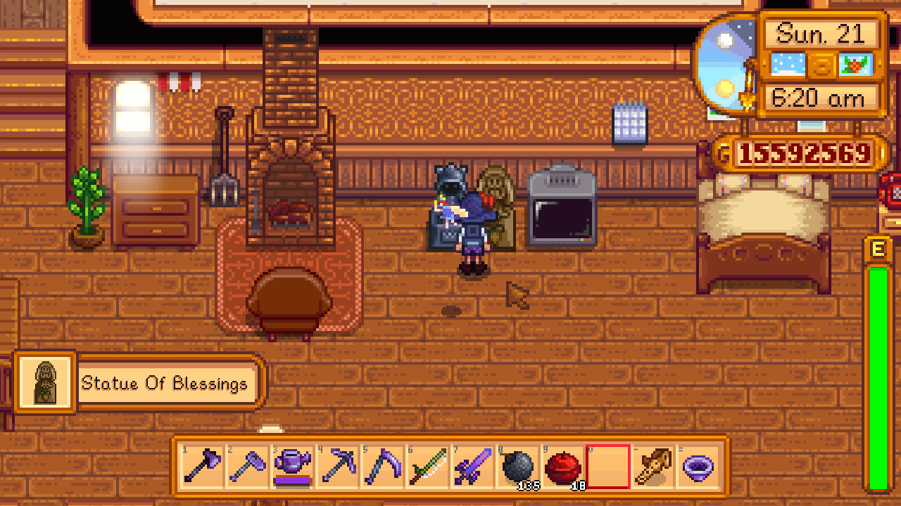
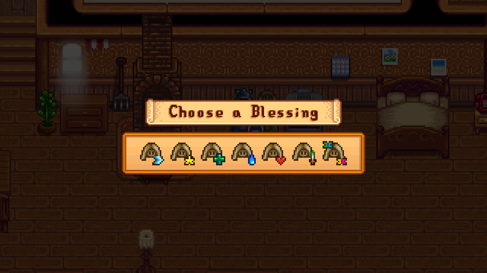
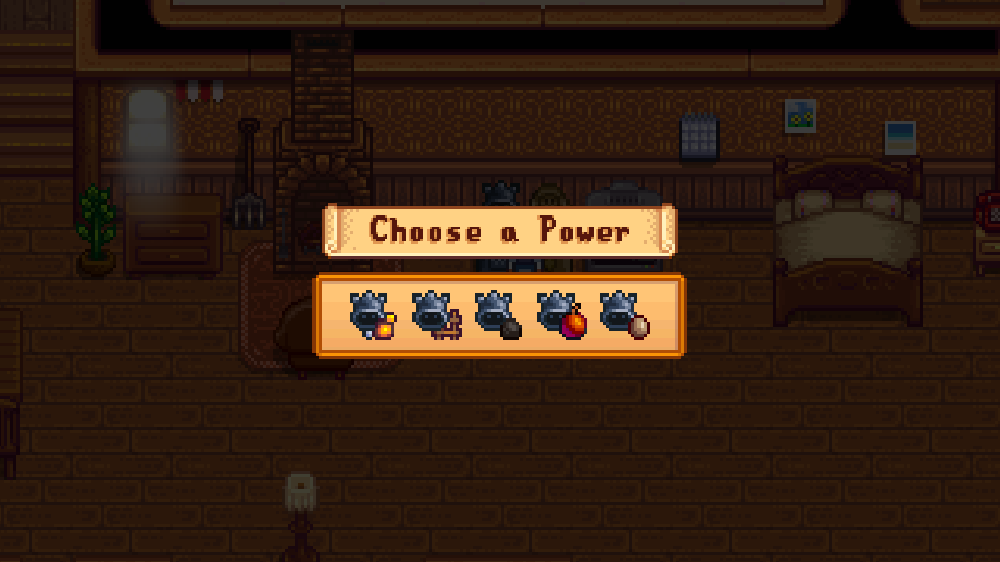

# How does it work?
Once the mod is installed, the standard "random" logic of the statues is replaced with a user-controlled selection process:
- **Interaction:** Approach the Statue of Blessings or the Statue of the Dwarf King as you normally would.
- **The Menu:** Upon interacting, instead of receiving an immediate random effect, a clear selection menu will appear on your screen.
- **Selection:**
    - **Statue of Blessings:** You can choose from the full list of daily blessings (such as the Blessing of the Butterfly, etc).
    - **Statue of the Dwarf King:** You are no longer restricted to a random pair of options. You can now browse and select any power from the entire pool.
- **Activation:** Once selected, the blessing or power is applied to your character immediately, and the statue is "spent" for the day, just like in the vanilla game.

# Installation
1. Install **[SMAPI](https://smapi.io/)**.
2. Download **[focustense's StardewUI](https://github.com/focustense/StardewUI)** mod.
3. Download `Selectable Buffs`.
4. Unzip the mod folder into `Stardew Valley/Mods`.

# Compatibility
- Compatible with Stardew Valley 1.6+
- Supports keyboard, mouse, and controller inputs for the selection menu, thanks to **StardewUI**.

# Special Thanks
This mod was made possible by a commission from someone who prefers to remain anonymous. Thank you for your support.

# Screenshots

  
Animated Gif

  

  
Statue of Blessings

  

  
Statue of the Dwarf King

  

